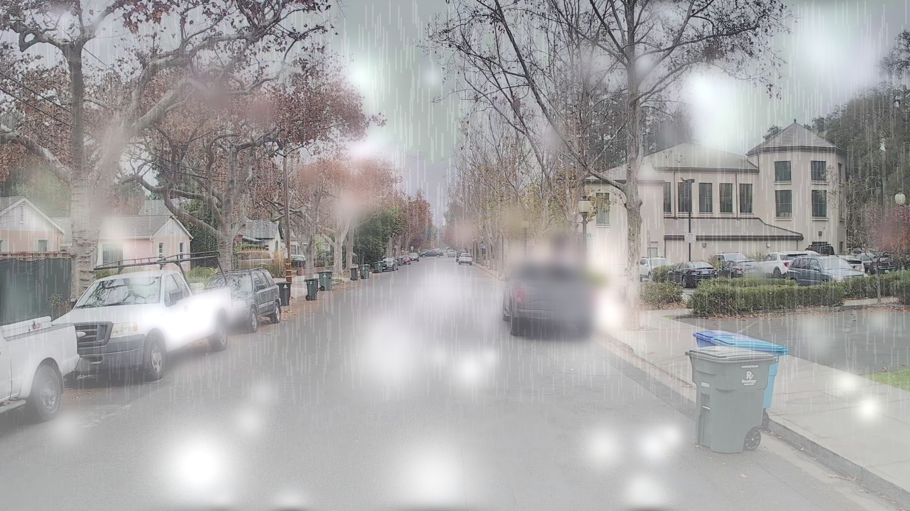
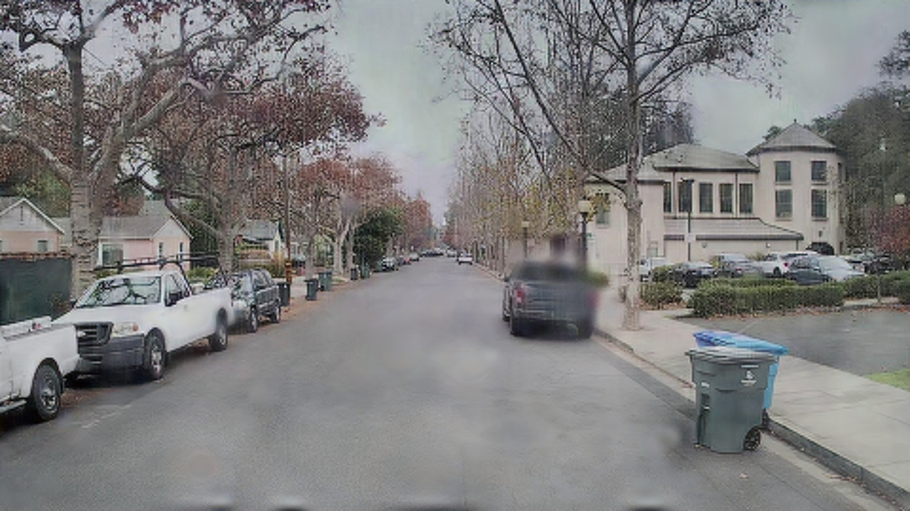
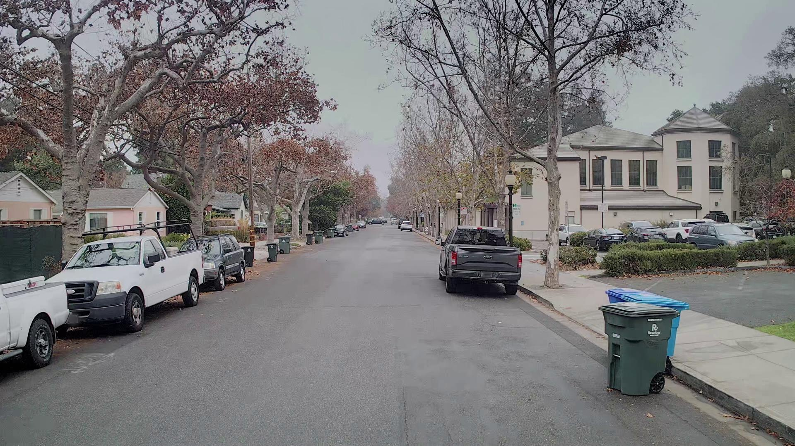

# 🚗 Real Time AV Camera Deraining

## 📌 Project Overview
**Real-time video restoration for autonomous driving.**
This project implements a deep learning pipeline to remove raindrops, streaks, and fog from dashcam footage, restoring visibility for both human drivers and downstream computer vision tasks (e.g., object detection).

The model is built on a **MobileNetV3-UNet** architecture, optimized for speed and deployed with a custom **"Crapification"** pipeline to generate synthetic training data from clean driving sequences.

---

## 🎥 Showcase & Examples

### Real-Time Inference

**🎥 Video Showcase: Degraded Dashcam Footage vs. Model's Restored Output**

<table>
  <tr>
    <td width="80%" rowspan="3">
      <video src="https://github.com/user-attachments/assets/1d5add9f-28b9-4baa-ab77-7cf0b4d67ee6" width="100%" controls></video>
    </td>
    <td width="20%" align="left" valign="middle" nowrap><h3>▌&nbsp;Degraded&nbsp;Input</h3></td>
  </tr>
  <tr>
    <td width="20%" align="left" valign="middle" nowrap><h3>▌&nbsp;Model&nbsp;Output</h3></td>
  </tr>
  <tr>
    <td width="20%" align="left" valign="middle" nowrap><h3>▌&nbsp;Ground&nbsp;Truth</h3></td>
  </tr>
</table>

### Static Sample Output

**🖼️ Image Comparison: Ground Truth, Artificially Degraded (Rain/Fog), and Model's Restored Output**

<table>
  <tr>
    <td width="80%"></td>
    <td width="20%" align="left" valign="middle" nowrap><h3>▌&nbsp;Degraded&nbsp;Input</h3></td>
  </tr>
  <tr>
    <td width="80%"></td>
    <td width="20%" align="left" valign="middle" nowrap><h3>▌&nbsp;Model&nbsp;Output</h3></td>
  </tr>
  <tr>
    <td width="80%"></td>
    <td width="20%" align="left" valign="middle" nowrap><h3>▌&nbsp;Ground&nbsp;Truth</h3></td>
  </tr>
</table>

---

## 💾 Pre-trained Model

You can evaluate the best performing model directly without needing to retrain. The final trained weights for the Stage 2 model are located at:

👉 `training/checkpoints/stage2/best_stage2.pth`

---

## 🚀 Key Features
- **⚡ Real-Time Performance**: Achieves **>30 FPS** on standard GPUs (RTX 3060/4090).
- **🏗️ Two-Stage Curriculum Training**:
  - **Stage 1**: Structural Recovery (Pixel Loss only).
  - **Stage 2**: Texture Refinement (SSIM + Edge + Perceptual Loss).
- **🌧️ Synthetic "Crapification" Pipeline**:
  - Generates realistic rain streaks, droplets, and depth-based fog.
  - Uses **MiDaS** for depth estimation and **RainStreakDB** for masks.
- **🎥 Temporal Consistency**:
  - Includes experimental support for **ConvLSTM** to enforce frame-to-frame coherency.

---

## 📂 Dataset
This project utilizes high-quality urban driving sequences from the **Wayve Open Dataset**.
- **Source**: [WayveScenes101](https://wayve.ai/science/wayvescenes101/)
- **Role**: The "Clean" frames from Wayve serve as the ground truth. Our pipeline artificially degrades them to create paired `(Rainy, Clean)` training samples.

---

## 🛠️ Installation

1. **Clone the repository**:
   ```bash
   git clone https://github.com/meirs10/realtime-av-camera-deraining.git
   cd realtime-av-camera-deraining
   ```

2. **Install dependencies**:
   ```bash
   pip install -r requirements.txt
   ```
   *Requires Python 3.8+ and PyTorch with CUDA support.*

---

## 🏃 Usage

### 1. Data Generation ("Degradation")
Generate synthetic rainy data from your clean videos.
```bash
python degradation_pipeline/per_video_degradation_pipeline.py
```

### 2. Training
The model is trained in two stages for stability.

**Stage 1: Structural Warmup**
```bash
python training/train_stage_1.py
```
*Goal: Remove rain and restore basic scene structure (loss: L1).*

**Stage 2: Fine-Tuning**
```bash
python training/train_stage_2.py
# OR for ConvLSTM experiment:
python training/training_attempts/train_with_convlstm.py
```
*Goal: Recover fine textures (asphalt, signs) and sharpen edges using Perceptual + SSIM losses.*

### 3. Testing & Evaluation
Run inference on the test set and calculate metrics (PSNR, SSIM).
```bash
python testing/testing.py
```

---

## 📊 Results (Stage 2)

| Metric | Value |
| :--- | :--- |
| **Test Loss** | 0.1975 |
| **Best Val Loss** | 0.1927 |
| **MAE** | 0.0587 |
| **MSE** | 0.0083 |
| **PSNR** | **21.63 dB** |
| **FPS** | **>33 FPS** |

*Results evaluated on the test set using a 3x5 tiled inference strategy.*

---

## 🔮 Future Work (Potential Improvements)
- **Vision Transformers (SwinIR)**: To capture long-range dependencies.
- **Unsupervised Domain Adaptation (CycleGAN)**: To bridge the gap between synthetic and real-world rain.
- **End-to-End Optimization**: Training jointly with YOLO ensuring restoration improves detection accuracy.

---

**University Project | 2026**
